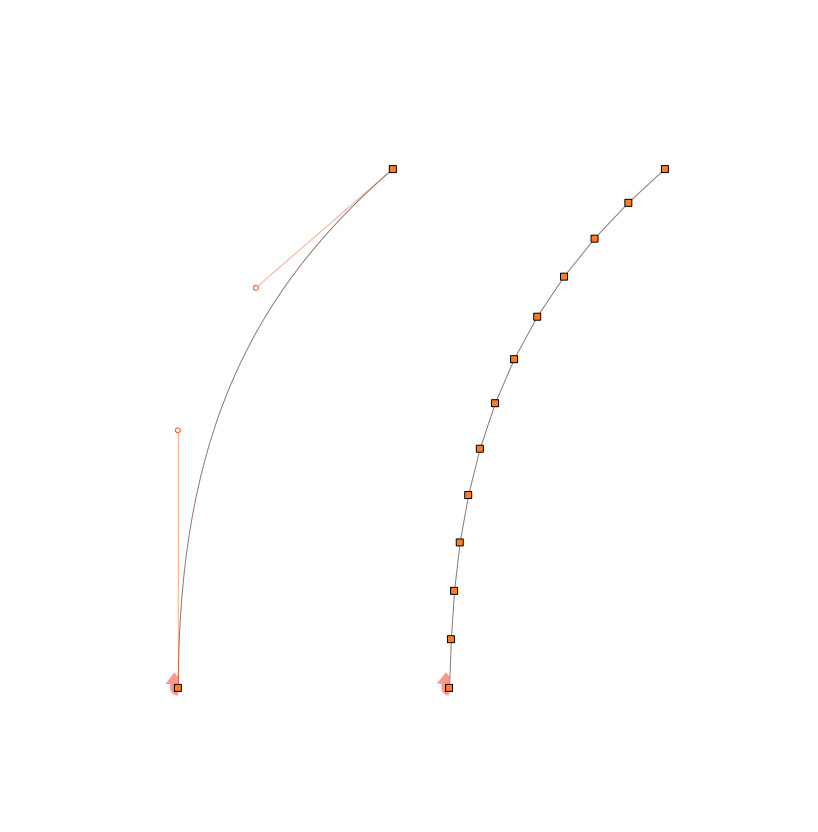
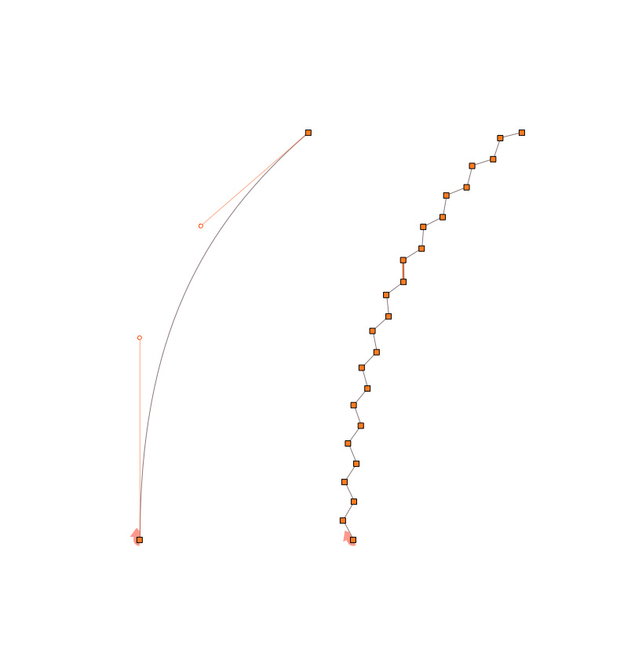
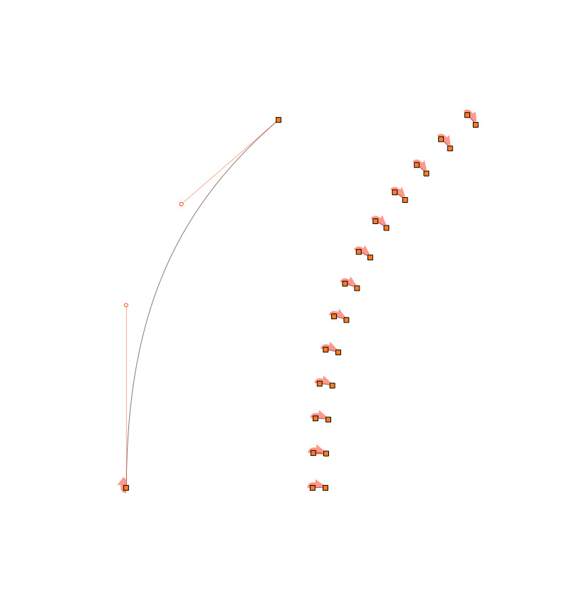
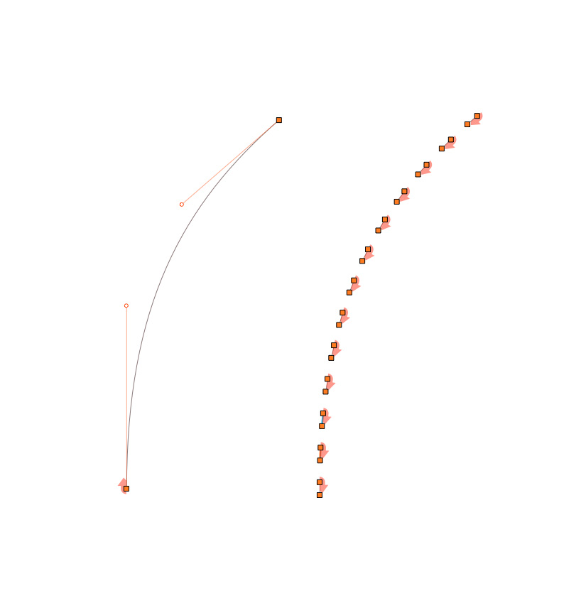
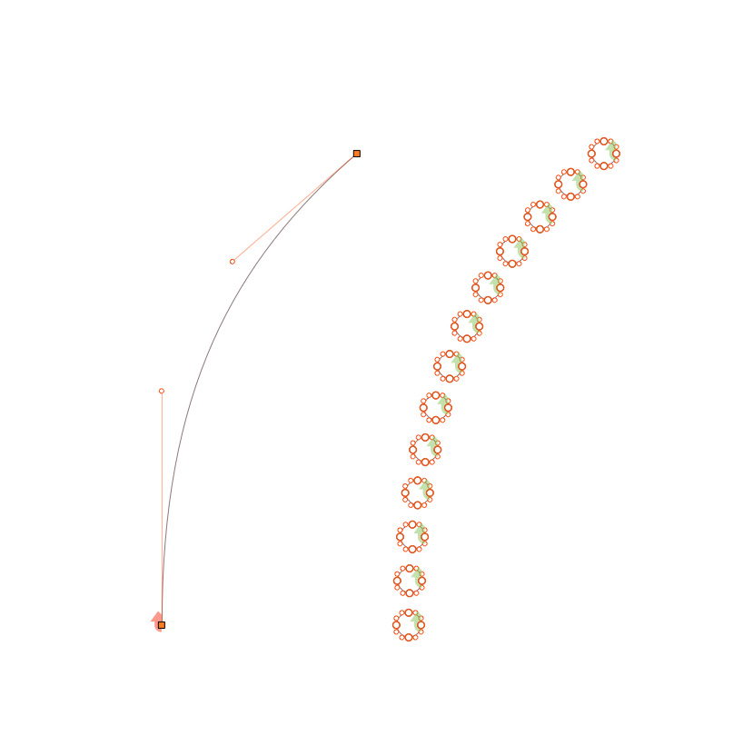
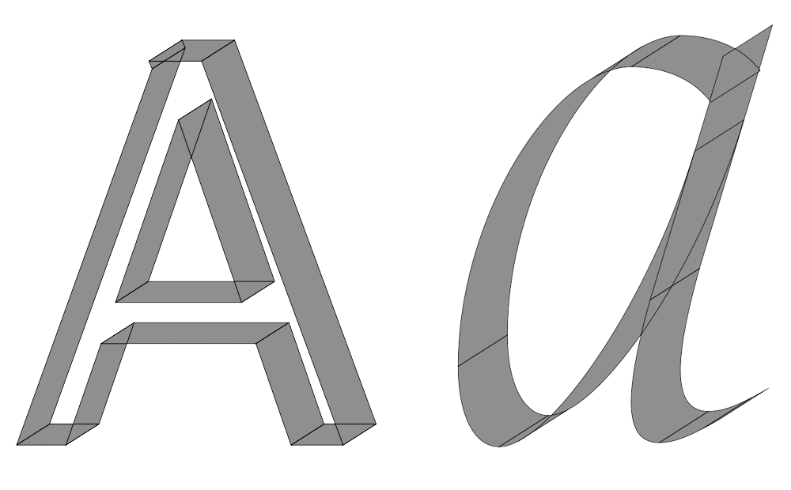

Robofab Pens
================

A collection of [Robofab pens](http://robofab.org/objects/pen.html) doing various things with outlines.

## stepPen.py

The StepPen is a basic pen not meant to be used in itself, it serves as a basis for subclassing. 

Existing implementations:

+ **FlattenPen**: flatten curves into a series of segment (similar to robofab.pens.filterPen.FlattenPen).
```python
filterPen = stepPen.FlattenPen(otherPen, pace=50)
```


+ **SpikePen**: Adds spikes to an outline… (similar to robofab.pens.filterPen.spikeGlyph).
```python
filterPen = stepPen.SpikePen(otherPen, pace=50, spikeLength=15)
```


+ **JitterPen**: flatten curves with added noise.
```python
filterPen = stepPen.JitterPen(otherPen, pace=50, xAmplitude=6, yAmplitude=8)
```


+ **DashPen**: converts an outline into a succession of independent line segments. They can be perpendicular or tangent to the outline.
```python
filterPen = stepPen.DashPen(otherPen, pace=50, length=25, normal=True)
```


```python
filterPen = stepPen.DashPen(otherPen, pace=50, length=25, normal=False)
```


+ **DotPen**: converts an outline into a succession of circles.
```python
filterPen = stepPen.DotPen(otherPen, pace=50, radius=15)
```



## translationPen.py

This pen allows for the drawing of a translated shape according to defined angle and width/length.



## cleanPointPen.py

Pen to clean up outlines by filtering out overlapping points and   small junk contours (user can define a minimal area to filter small contours out.)